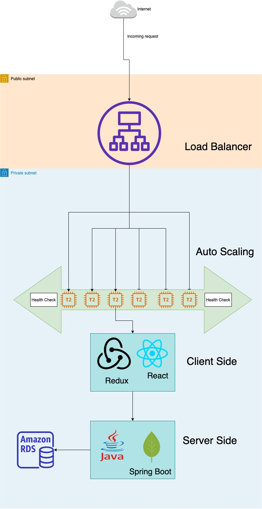

# Hire-N-Hop
Car Rental Service

# Team Members

<b>Varsha Pothaganahalli Jairam</b> - 013931242  
<b>Ashwini Ulhas Talele</b> - 014483456  
<b>Kedar Acharya</b> - 014151891  
<b>Belinda Terry</b> - 013785668  

# Link 
http://rent-alb-1410839008.us-west-1.elb.amazonaws.com/

# Wireframes
https://github.com/gopinathsjsu/sp20-cmpe-202-sec-03-team-project-team-202-akbv/blob/master/UI-wireframes/UIWireframe.png

# Scrum Report + Journal 
https://github.com/gopinathsjsu/sp20-cmpe-202-sec-03-team-project-team-202-akbv/tree/master/Aglie%20Documents

# Application Screenshots
https://github.com/gopinathsjsu/sp20-cmpe-202-sec-03-team-project-team-202-akbv/blob/master/Application%20Screenshot/Application%20Screenshots.pdf

# Load Balancing Screenshots
https://github.com/gopinathsjsu/sp20-cmpe-202-sec-03-team-project-team-202-akbv/blob/master/Application%20Screenshot/Load%20Balancing.pdf

# Design Patterns used

## DAO Pattern

We have used DAO classes to interact with database layer.

## MVC Pattern

We have used Controller classes. It is the first point of contact when the request is sent from View. 
Also, we have Model classes for our entities.

## Command Pattern

We have used ReactJS, which has states and an event which continuously listens to any change in states.

## Team Contribution

<b>Varsha Pothaganahalli Jairam</b> - Depolyment, Backend routes, Db Schema creation

<b>Ashwini Ulhas Talele</b> - Frontend, wireframes, Db Schema creation

<b>Kedar Acharya</b> - Backend routes, Db Schema creation

<b>Belinda Terry</b> - Frontend, wireframes, Db Schema creation

<h1>Architecture Diagram</h1>

The Maven project was converted into an executable JAR, which was Dockerised and deployed on an EC2 instance. 

# Load Balancing

We have used an Application Load Balancer with auto scaling (min - 1, max - 3).
Client uses the load balancer URL, and according to requests, the load balancer creates new servers. If any instance degrades in health, auto-scaling kicks in and ensures the application remains available.

# Database

We used MYSQL database and hosted it on Amazon RDS.
We choosed relational database as the requirements had functional relationships and we thought relational database could be the best fit in this scenario.

scripts- 
https://github.com/gopinathsjsu/sp20-cmpe-202-sec-03-team-project-team-202-akbv/tree/master/database

# Backend

We used Java Spring Boot as our backend technology stack.
We used hibernate session to connect to the database and for inserting/updating/deleting/reading from and to database.

# Frontend

We used ReactJS as our frontend library.
React is fast, scalable and lightweight. It offers the benefits of using state for responsive UI development.

Application screenshots and Agile documents are included in the master branch.
